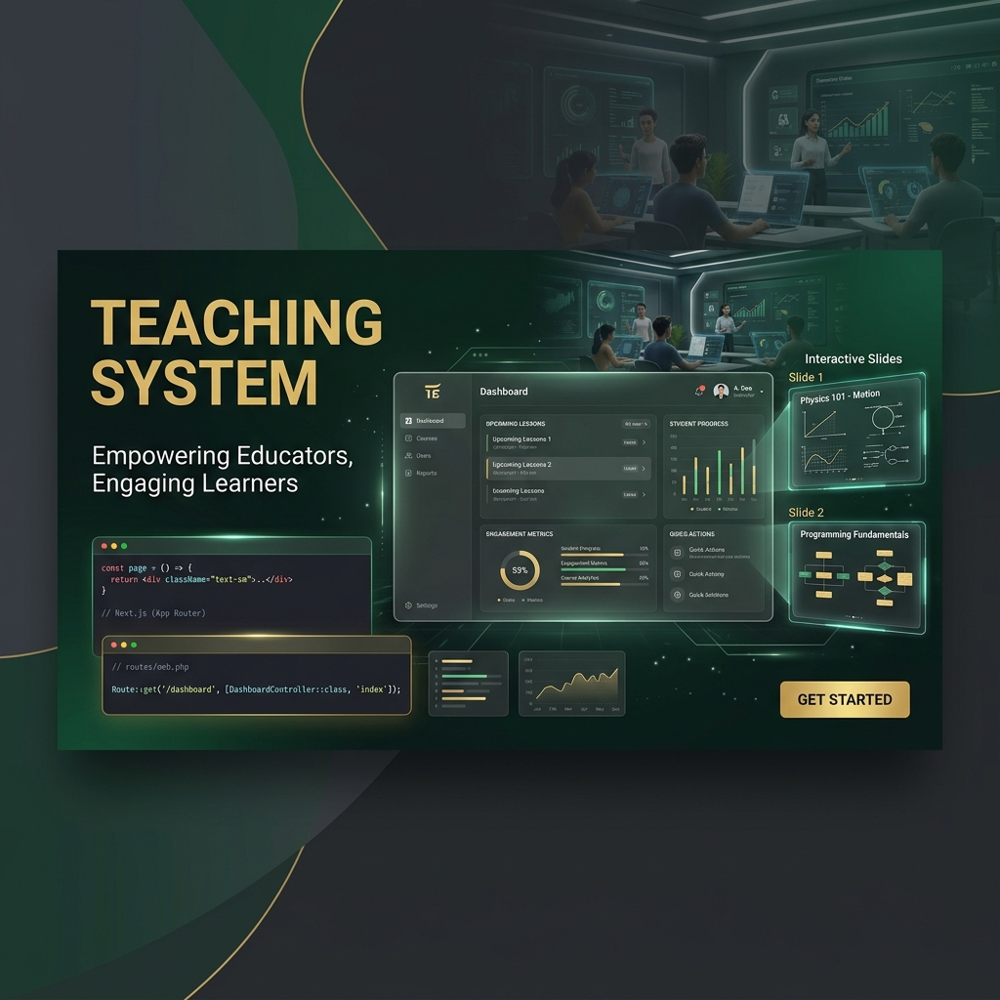

# 🎓 Teaching System Studio



A high-fidelity, full-stack monorepo designed for educators to manage curriculum and for students to engage with interactive learning materials. This system streamlines the delivery of technical courses (Next.js, Laravel, Git, etc.) through a professional, integrated environment.

---

## ✨ Features

- **📺 Interactive Slide Engine**: Premium, markdown-supported slide presentations with full-screen chapter navigation and localized Khmer terminology support.
- **🛠️ Integrated Admin CMS**: A studio-style dashboard for educators to manage Courses, Modules, Lessons, and Slides with deep-copy duplication support.
- **💻 Live Code Sandbox**: Built-in code editor (Monaco) with real-time browser/terminal/editor theme previews for teaching coding concepts.
- **📡 API Testing Suite**: Interactive interface for students to test and intercept RESTful API calls to the Laravel backend.
- **🔒 Role-Based Access**: Secured educator (Admin/Teacher) and student workspaces with strict data isolation.
- **🚀 Docker-Ready**: Fully containerized environment for seamless local development and offline classroom usage.

---

## 🛠️ Technical Stack

### **Frontend**
- **Framework**: [Next.js 15 (App Router)](https://nextjs.org/)
- **Styling**: Tailwind CSS v4 & Vanilla CSS
- **State Management**: React Context & URL-synchronized navigation
- **Components**: High-fidelity custom UI components with dark mode support.

### **Backend**
- **Framework**: [Laravel 11](https://laravel.com/)
- **API Architecture**: RESTful API with JWT Authentication
- **Database**: PostgreSQL (Dockerized)
- **Patterns**: Service Layer Pattern & Role-based Middleware

---

## 🚀 Quick Start

### **1. Prerequisites**
Ensure you have **Docker Desktop** installed and running on your machine.

### **2. Launch Containers**
In the project root, run:
```bash
docker-compose up -d --build
```

### **3. Initialize Database**
Once the containers are healthy, run the migrations and seed the initial curriculum:
```bash
docker-compose exec laravel php artisan migrate:fresh --seed
```

### **4. Access Points**
- **Dashboard (Frontend)**: [http://localhost:3001](http://localhost:3001)
- **API Docs (Backend)**: [http://localhost:8080/api](http://localhost:8080/api)
- **Database**: Port `5432`

---

## 📁 Project Structure

```text
├── frontend/          # Next.js Application (Admin Studio & Student Viewer)
├── backend/           # Laravel 11 API (Curriculum & User Management)
├── docker/            # Infrastructure configurations (PHP, Nginx, Node)
├── docs/              # System documentation and assets
└── docker-compose.yml # Service orchestration
```

---

## 📝 Troubleshooting

- **CORS Issues**: Ensure your `backend/.env` has `FRONTEND_URL=http://localhost:3001`.
- **Hydration Errors**: Some browser extensions (like Password Managers) might inject code into the body. The layout is configured with `suppressHydrationWarning`.
- **Database Connection**: If the Laravel container can't connect, verify the `DB_HOST=db` setting in the backend environment.

---

## 🤝 Contribution

This system is built with a focus on **Visual Excellence** and **User Engagement**. When contributing, please ensure:
1. Micro-animations are maintained for high-quality UX.
2. Typography remains consistent with the RUPP design system (Inter/Outfit).
3. All new API endpoints include proper role-based validation.

---

*Designed and Maintained for Advanced Agentic Coding.*
